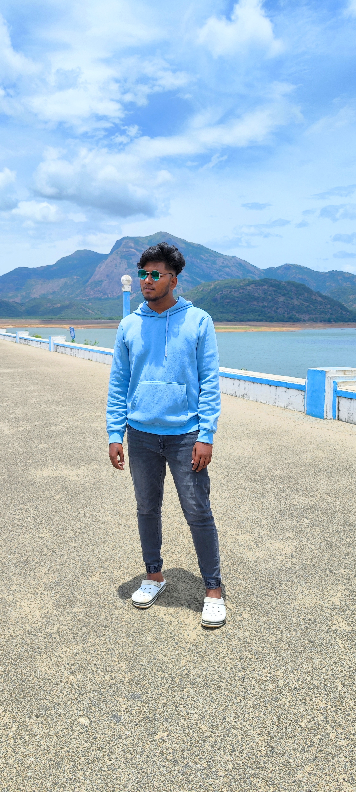

<h1 align="center">Hi 👋, I'm Anbu Murugan</h1>

###

  

###

A passionate about automation & CI/CD

###

<h2 align="left">About me</h2>

###

📚I am currently gaining hands-on experience as an AWS & DevOps intern, where i am working on cloud infrastructure, automation, and deployment pipelines.  Passionate about leveraging AWS services, Infrastructure as code (Iac), and containerization to streamline DevOps processes.

###

<h2 align="left">Skills & Tools:</h2>

###

  
  
  
  
  
  
  
  
  
  
  
  
  
  
  

###

Connect with me:

###

  <a href="https://linkedin.com/in/AnbuMurugan" target="blank"> 
  <a href="https://instagram.com/the_biker_kidzz" target="blank"> 

###
